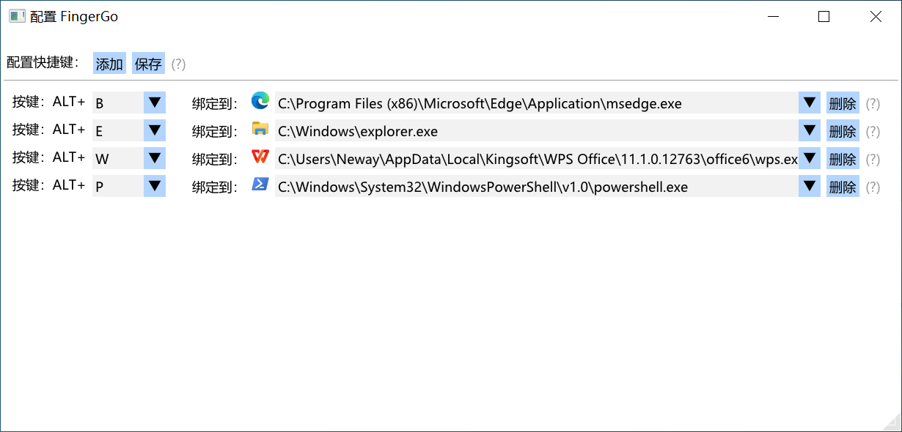

# fingerGo

📃任务栏图标太多，找程序找的眼睛疼，还找错，影响打工人打工？

🤵被老板发现上班在摸鱼？

## 功能

帮你将按键与程序绑定，按下按键时快速切换到该程序。例如将 `W` 与 `word程序` 绑定，按下快捷键`ALT + W`即可快速切换到`word程序`。

同样的一个快捷键，在不同场景下，可以实现:

- 启动程序

- 前置程序

- 最小化程序

- 相同程序的不同窗口见来回切换

具体见下面使用场景。

## 使用场景

下面依然以word程序为例：

- 场景1：word没有打开——>快捷键将自动帮你打开word；

- 场景2：已经打开了一个word，但是word程序在后台——>快捷键将自动切换到word；

- 场景3：已经打开了一个word，前台也是word——>快捷键将自动最小化word，将其隐藏；

- 场景4：已经打开了多个word，前台也是word——>快捷键将自动在多个word间切换；

## 安装

免安装，直接从Release下载最新版运行即可，仅支持win10、win11，win7见谅。

## 开发

下载后导入Visual Studio 即可正常调试运行。

## 常见问题

1. 下拉框找不到目标程序？

   FingerGo 会自动扫描打开的程序供你选择，如果找不到，先打开它；

3. 配置页面程序图标不显示？
   
   FingerGo 读取的是之前配置的程序路径，不显示图标可能是程序被移动或者某些程序升级会导致程序目录变动，解决：重新为该程序配置快捷键即可。

4. 代码太烂？
   
   小弟第一次用C++写代码，就为了实现这个程序，能写出来我就很开心了，你忍一下好不好😭。

## 感谢

界面开发使用了：[ocornut/imgui](https://github.com/ocornut/imgui)

图片加载使用了：[nothings/stb](https://github.com/nothings/stb)
